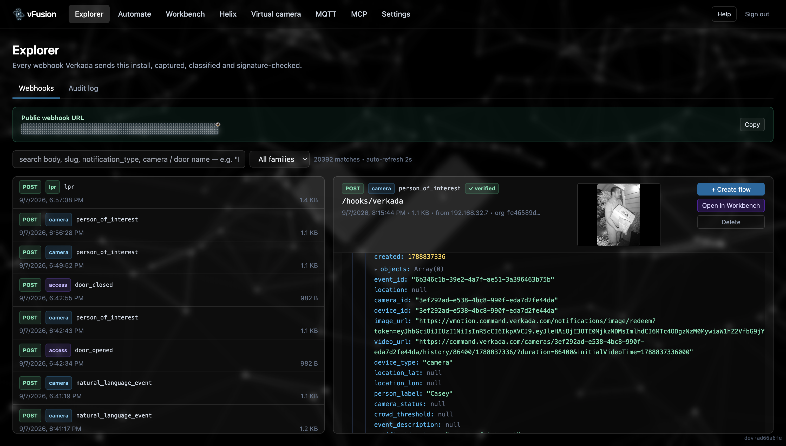
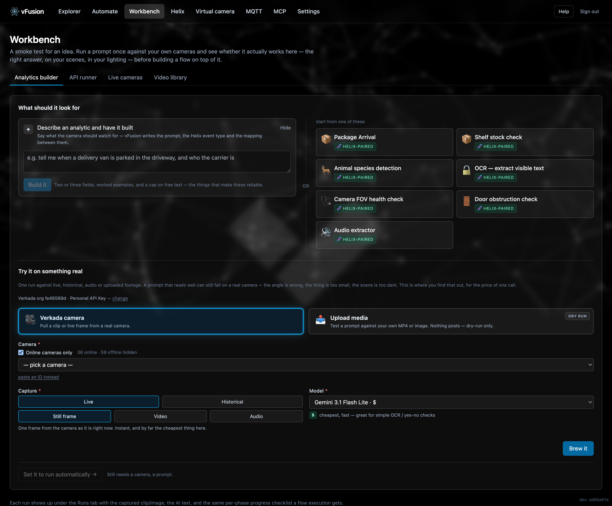
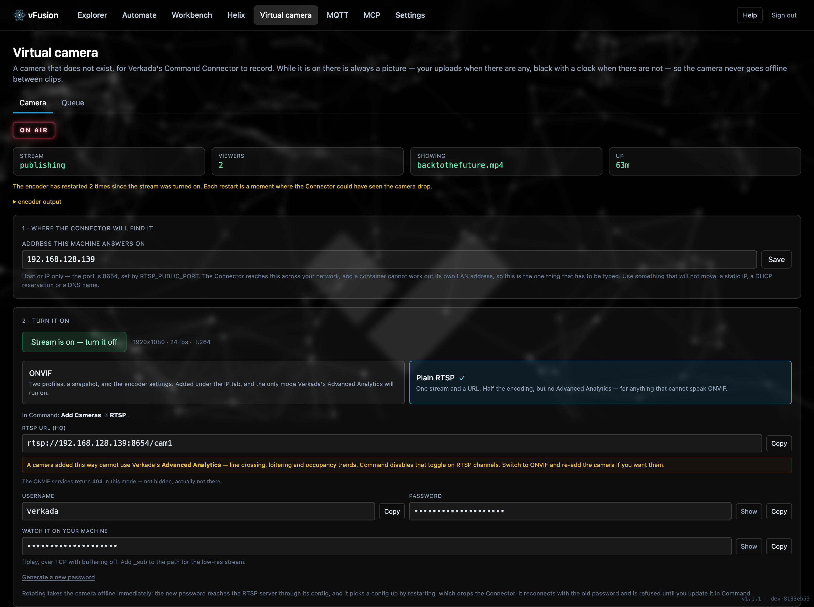
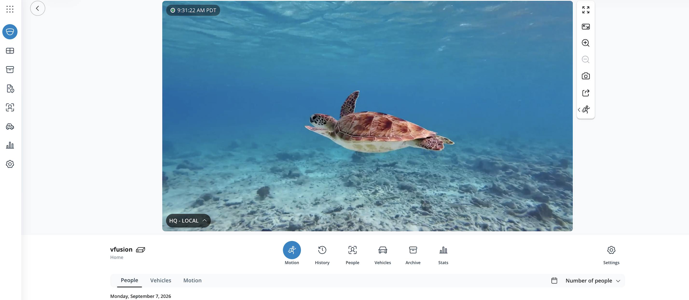
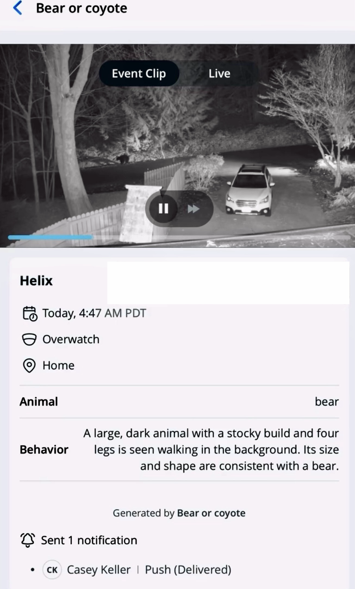

<p align="center">
  
</p>

<p align="center">
  <strong>Self-hosted workflow automation for the Verkada API.</strong><br>
  Catch webhooks, mirror the audit log, put Gemini on your cameras, write the answers back into Command as Helix events.<br>
  Think Zapier, built around Verkada.
</p>

<p align="center">
  <a href="#quick-start">Quick start</a> ·
  <a href="#what-it-does">What it does</a> ·
  <a href="#screenshots">Screenshots</a> ·
  <a href="#documentation">Docs</a> ·
  <a href="#security">Security</a> ·
  <a href="#faq">FAQ</a>
</p>

> **Version 1.1, beta, and not an official Verkada product.** Built by a Verkada SE as a personal project. Expect breaking changes; no warranty ([LICENSE](LICENSE)). It can unlock doors, pull footage and call any API your key allows, so read [Before you deploy](#before-you-deploy) first.

## What it does

vFusion is a visual router for everything that happens in a Verkada org. Events come in, flows run, results land back in Command.

**See everything**

- 📥 **Webhooks** — every event Verkada sends, captured at `/hooks/*`, classified into a family, HMAC-verified, searchable by camera and door *name*.
- 🔎 **Audit log** — a local copy of Command's audit log, pulled every 10 seconds, filterable by user, event, device, IP, key, endpoint and status code, with counts on every value and CSV export. No 90-day cap. Any entry becomes a flow trigger with one click.
- 📈 **Insights** — who is active, what they do, from where, against which devices and endpoints. **Streaming activity** on a swimlane per camera: who watched what, when, for how long. Click any mark to narrow every chart at once, then switch to the rows when you want them.
- 🌍 **Where an address is** — city and region beside every IP, with proxy and hosting flags.

**Automate it**

- 🎨 **Visual flow editor** — drag-and-drop canvas with conditions, branches, variables from real events, a per-step run button, and an assistant that answers questions without touching the canvas.
- ⚡ **Three kinds of trigger** — a Verkada webhook, a schedule on your clock, or **an audit-log entry**: "a user started a live stream", "a door was modified", "an API call returned 403", within ten seconds of it happening.
- 🧠 **Draft a flow from a sentence** — grounded in your real cameras, doors and event types, validated against the action registry, replayed against stored events so "will this fire?" has evidence.
- 🎥 **Gemini on your cameras** — a historical clip, a single live frame (about 10× cheaper), or just the audio track (about 8× cheaper). Gemini 3.1 Pro, 2.5 Pro, 2.5 Flash.
- 🚪 **Verkada actions** — unlock doors, activate and release Access scenarios, post schema-validated Helix events, or call any cataloged endpoint.
- 💬 **Slack and Discord** — post the result to a channel through an incoming webhook, with the analysis in the message rather than just "something happened".
- 🧩 **Starter templates** that ask their own questions on install, plus save-as-template, export and import.

**Try before you build**

- 🧪 **Workbench** — run a prompt once against a camera, an upload or an audio track; describe an analytic and have it written; then **Automate** it in one click.
- 🔧 **API runner** — every Verkada endpoint, browsable by category, with pickers for the ids you cannot know, run against a connection you already hold.
- 📺 **Live cameras** in the browser, without the browser ever seeing a Verkada credential.

**New worlds**

- 🎬 **Virtual camera** — show someone what their cameras would look like in Command without a Command Connector on their site. Play a clip through it and Command records it as an ordinary camera, analytics and all, over RTSP with ONVIF Profile S on one unbroken stream. Clips, a URL or a live source, or footage generated with Veo that looks like a ceiling dome shot it.
- 📡 **MQTT** — broker, certificates and credentials generated for you; configure cameras to publish live object positions; watch the boxes, filter the noise, replay a track beside its footage.
- 🧰 **MCP explorer** — browse Verkada's Model Context Protocol server with the key you already have: every tool badged read-only, writes or destructive, and a history of when each one appeared.
- 🏷 **Helix** — draft event types from a sentence, send test events by hand, read back what is really on Verkada, and seed a plausible week of demo data for an integration nobody has built yet.

**Run it with confidence**

- 🔐 **Two-factor sign-in** with any authenticator app and one-time backup codes, secrets encrypted at rest, generated signing keys, session revocation, login throttling, and a Security tab that measures the running install rather than reciting a checklist.
- 🛡 **Is anyone else using my key?** A monitor that walks the audit log and flags any address using vFusion's Verkada key that is not vFusion.
- 💸 **Cost tracking** for everything that spends, and a spending cap that pauses flows for the month.
- 🌐 **Public URL built in** — a free TryCloudflare URL in quick mode, your own domain in lab mode; only `POST /hooks/verkada` is ever exposed.
- 💬 **Help that knows this build** — an in-app chat assembled from the source at runtime, so it is right about what exists and what does not.

## Example use cases

Every row is a one-click starter template on the Automate tab: trigger, steps and Helix event type pre-wired. Pick connections, answer the template's questions, enable.

| Template | Starts on | What the flow does |
|---|---|---|
| 🦌 **Animal species detection** | Motion webhook, objects = animal | Gemini returns `{animal, breed, behavior}` to a Helix "Animal Watch" event. Command alerts when it is a bear. |
| 🎙 **Audio extractor** | Webhook | Pulls the audio track; Gemini transcribes and describes it into Helix. |
| 🩺 **Camera FOV health check** | Daily | Gemini flags a blocked, blurry or mis-aimed view, with severity and reasoning. |
| 🚪 **Door obstruction check** | Schedule | Boxes, pallets or clutter blocking egress on a door-facing camera. |
| 📦 **Hourly shelf-stock check** | Hourly | Shelf fullness 0–100 to Helix; Command alerts floor staff when it drops. |
| 🔤 **OCR-triggered door unlock** | Motion webhook | Gemini reads a plate, badge or sign; on a match, unlocks the door and logs why. |
| 🚨 **POI-triggered lockdown** | Person-of-interest webhook | Activates a Command Access scenario. |
| 🔖 **License plate of interest added** | Audit log | Someone adds a plate to the watch list; the plate, the label, who added it and the alert settings land in Slack or Discord. No AI, nothing metered. |
| ⛅ **Weather sentry** | Every 30 minutes | Live conditions from OpenWeatherMap into a Helix Weather event. |

Not on the list? Describe it in a sentence on the Automate tab and the builder proposes the flow.

## Screenshots

**Draft a flow from a sentence.** Say what should happen and the builder proposes the trigger, the steps and any Helix event type onto the canvas, grounded in your real cameras and doors. Nothing is saved until you press Save.


**Explorer.** Every webhook Verkada sends, captured, classified and signature-checked, with the payload and its images beside the list. One click turns any event into a flow.



**Templates.** Eight complete automations, pre-wired with a trigger, the analysis and a Helix event type, grouped by what starts them.


**Workbench.** Describe an analytic and have it written, or start from one that ships. Then run it once against a real camera before building anything on top of it.



**MQTT object positions.** Every object a camera tracked through frame and out again, recorded as it happened, with the boxes replayed beside the footage they came from.


**Virtual camera.** "What would my cameras look like in Command?" normally means a trial: a Connector on site, on their network, wait. Play a clip through this instead and they find out today. One unbroken RTSP stream, with ONVIF Profile S so Advanced Analytics runs on it.



And Command's side of it: a camera that does not exist, recording, with motion and people analytics running on whatever is playing.



More in the [documentation](#documentation): the [API runner](docs/workbench.md), [live cameras](docs/workbench.md), the [MQTT broker setup](docs/mqtt.md), and [retention and stats](docs/settings.md).

### From analysis to Verkada Helix

Gemini's answer does not sit in a dashboard. The Helix action writes it back into Command as a searchable event on the camera and timestamp, and Command's own notification rules take it from there.

<p align="center"></p>

**Animal detection** — a wildlife camera flags a bear; Command pushes the alert.

<p align="center"></p>

**Door obstruction** — object type, severity and reasoning, posted only when something is in the way.

<p align="center"></p>

**Text extraction** — sign, label and badge text read off a clip and written to a Helix attribute.

<p align="center"></p>

**Beyond cameras** — live weather next to a camera in Command, on a schedule.

## Quick start

Docker is the only thing you install. Everything else runs in containers.

```bash
git clone https://github.com/PacketTrace/vFusion.git
cd vFusion
cp .env.example .env
docker compose --profile quick up --build -d
```

That starts everything except the two features that need their own containers: **MQTT** object positions and the **virtual camera**. Add them when you want them, in any combination:

```bash
docker compose --profile quick --profile mqtt --profile rtsp up --build -d
```

Open **http://localhost:15173**, set the admin password, and follow the welcome modal: copy the public URL and a generated signing secret into **Command → Admin → API & Integrations → Webhooks**. The first webhook to arrive unlocks the dashboard and creates your Verkada connection; add the API key under **Settings → Connections**.

That is quick mode: a free TryCloudflare URL that changes on restart. For a stable URL on your own domain, optional profiles (MQTT, virtual camera), browsing from another machine, every environment variable and backups, see **[Deploying](docs/deploying.md)**.

### Updating

```bash
./update.sh
```

It shows you what changed, backs the database up before the migrations, restarts with the profiles you already had running, and confirms the new version answered. `--check` says what it would do without doing it.

vFusion tells you when there is something to get: a green **Update** badge appears in the header with the version, the release notes and the command. It never updates itself — the only way to give a container that power is to hand it the Docker socket, which is root on the host, and this app already holds a key that can unlock doors. Set `UPDATE_CHANNEL=off` to stop it checking.

## Before you deploy

This tool can unlock doors, pull footage, post into Helix and call any endpoint your key allows. Treat it like the production system it talks to.

- **Scope the Verkada API key to least privilege.** Grant only what your flows need. If you only want camera analytics, do not grant door control.
- **Keep the dashboard off the public internet.** One password gates it, throttled, with optional two-factor but no per-user accounts. Bind it to LAN or localhost and reach it over Tailscale or a VPN. The only thing meant to face the internet is `POST /hooks/verkada`.
- **Always set a webhook signing secret.** Without it, anyone who knows your public URL can forge events, and a forged event can trigger a real action.
- **Cap Gemini spend twice.** vFusion's cap pauses flows; a budget alert in [Google AI Studio](https://aistudio.google.com/) is the real ceiling.
- **Know what Google does with footage.** On a free-tier Gemini key, [Google's terms](https://ai.google.dev/gemini-api/terms) allow training on your prompts and frames, with human review. Enable billing on the linked project before pointing this at production cameras.
- **Back up the `vfusion_secrets` volume.** It holds the key that encrypts every stored credential.

## Documentation

| Area | What is in it |
|---|---|
| [Deploying](docs/deploying.md) | Bootstrap, quick and lab modes, profiles, services and ports, every env var, secrets managers, updating, backups, troubleshooting |
| [Explorer](docs/explorer.md) | Webhooks, the audit log and its filters, audit-log triggers, geolocation, Insights |
| [Automate](docs/automate.md) | Templates, analytics, the flow editor, all three triggers, every action, conditions and variables, runs |
| [Workbench](docs/workbench.md) | Analytics builder, API runner, live cameras, video library |
| [Helix](docs/helix.md) | Event types, drafting, test sends, published events, the demo-data tool |
| [Virtual camera](docs/virtual-camera.md) | RTSP and ONVIF for the Command Connector, the queue, live sources, ports |
| [MQTT](docs/mqtt.md) | Built-in or external broker, camera configuration, live view, noise filter, history, what a broker must do |
| [MCP](docs/mcp.md) | The tool explorer and its history |
| [Settings](docs/settings.md) | Connections and regions, retention, the Security and Cost tabs, Stats, Help |
| [SECURITY.md](SECURITY.md) | How to report a vulnerability |

## Security

What is in the box:

- **Single admin password**, bcrypt-hashed, throttled after five attempts, with optional **two-factor** (TOTP plus backup codes; the secret lives encrypted in the secrets volume, never in the database). Sessions are signed cookies with an epoch, so **Sign out everywhere** and a password change revoke every session.
- **Every stored credential is Fernet-encrypted.** The encryption key and the cookie-signing key are generated on first boot and kept in a Docker volume; the repo ships no defaults for either.
- **Webhooks are HMAC-verified** against the signing secret, with replay tolerance and constant-time comparison.
- **The public surface is one path.** Quick mode enforces `POST /hooks/verkada` with Caddy; lab mode with the tunnel's route. Everything else answers 404.
- **A Security tab that measures the install**: which keys it stands on, what answers without a session, whether the throttle is engaged, and whether any other address is using your Verkada key.
- **Sensitive headers are redacted** before a webhook body is stored. **Retention windows** sweep events, media and runs on a schedule.
- **Two outbound lookups, both optional.** IP geolocation for the audit log goes to ip-api.com, only for addresses on screen, never private ones (`GEOIP_PROVIDER=off`). The update check reads GitHub's public release list every six hours and sends nothing about the install, not even its version (`UPDATE_CHANNEL=off`).
- **No self-update.** A newer release is a badge and a command, never a button that runs one. Giving a container the power to replace itself means giving it the Docker socket, which is root on the host.

What is not: multi-user accounts, RBAC, or horizontal scaling. Anyone with both the `vfusion_secrets` volume and the database can decrypt every credential. Details, the threat model and the reporting process: [docs/settings.md → Security](docs/settings.md#security) and [SECURITY.md](SECURITY.md).

## Help expand the taxonomy

Inbound webhooks are classified with a built-in taxonomy. Verkada ships new types from time to time; anything unrecognised is grouped on the **Unrecognized** page. If you see one, [open an issue](https://github.com/PacketTrace/vFusion/issues/new) with the `webhook_type` and `notification_type` and a sample payload if you can spare one.

## FAQ

<details>
<summary><strong>Why Gemini and not another AI provider?</strong></summary>

Gemini is the only major LLM with a usable **video** API; everything else tops out at stills. Sending real camera clips through a model is the headline feature, so Gemini was the fit. Still-image and text-only steps could take other providers sooner.

</details>

<details>
<summary><strong>How accurate is the cost estimate?</strong></summary>

Usually within a few percent. Token counts come off each Gemini response and are priced from a built-in table refreshed daily. It can miss cached-token tiers, regional pricing and changes between refreshes, and video generation is priced per second rather than per token. The Cost page lists every source that spends, including the ones at zero, so a feature that is not being counted is visible. Google's billing is the truth; set a budget alert there regardless.

</details>

<details>
<summary><strong>Does my key or data go anywhere?</strong></summary>

No telemetry and no analytics. Keys are encrypted in your Postgres and only leave the host when a flow calls Verkada or Gemini. Google sees what you send Gemini, under terms that depend on whether the key's project has billing enabled. Cloudflare sees TLS-encrypted webhook traffic if you use a tunnel.

Two requests go out that are not yours, and both can be turned off. The audit log's geolocation sends public IP addresses to ip-api.com (`GEOIP_PROVIDER=off`). The update check reads GitHub's public list of releases every six hours (`UPDATE_CHANNEL=off`); it is a plain unauthenticated read that carries no version, no org and no identifier, so GitHub learns your IP address and nothing else.

</details>

<details>
<summary><strong>How does it get me notified?</strong></summary>

Two ways. A flow can post straight to a **Slack or Discord channel**, which is the right answer when the people who need to know live in chat. Or it writes a **Helix event** and you configure the alert on that event type in Command, which puts the notification next to the footage it came from. No email, SMS or push by any route.

</details>

<details>
<summary><strong>How well does it scale?</strong></summary>

One Postgres, one Redis, one worker. Comfortable for an org with hundreds of webhooks a day and an audit log of tens of thousands of rows a day; not designed for thousands of webhooks a minute. The audit log is indexed and filters in milliseconds at millions of rows.

</details>

<details>
<summary><strong>Where do I file bugs or requests?</strong></summary>

[github.com/PacketTrace/vFusion/issues](https://github.com/PacketTrace/vFusion/issues). For bugs, include `docker compose logs backend | tail -100` and the steps. For requests, a concrete example beats a wishlist item.

</details>

<details>
<summary><strong>Can I fork it?</strong></summary>

Yes. MIT licensed: fork it, run it commercially, repackage it. Keep the `LICENSE` file. Credit is appreciated, not required.

</details>

## Author

**Casey Keller** ([GitHub](https://github.com/PacketTrace) · [LinkedIn](https://www.linkedin.com/in/casey-keller-b00246b6/)), a Verkada SE. vFusion is a personal project and not an official Verkada product.
