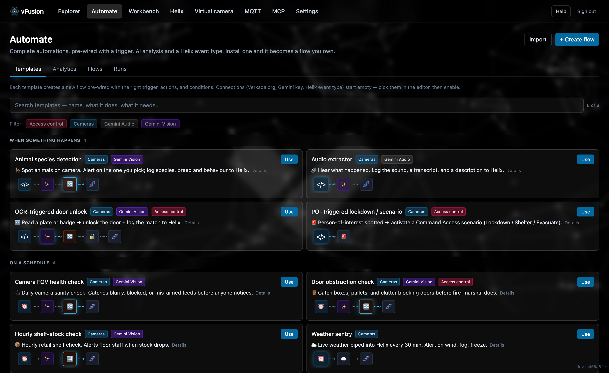
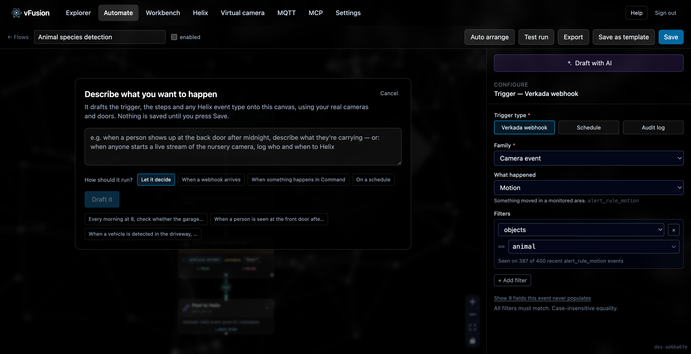

# Automate

*Templates, analytics, flows and their runs. Everything that turns an event into an action lives here.*

**Where:** the **Automate** item in the nav. Four tabs: Templates, Analytics, Flows, Runs.

## The two things you build

- A **flow** is a whole automation: a trigger, some steps, usually a Helix event at the end. Flows are created **disabled**; enabling one is always a deliberate act.
- An **analytic** is the "what to look for" half on its own: a prompt that forces JSON out of the model, the Helix event type it writes into, and the mapping between them. No trigger. You run one on the [Workbench](workbench.md), or pick it inside a flow's analysis step.

## Templates

Eight starter flows ship with the product, pre-wired with a trigger, the Gemini and Verkada steps, and the Helix event type they post to.

| Template | Starts on | What it does |
|---|---|---|
| 🦌 Animal species detection | Motion webhook, objects = animal | Gemini returns `{animal, breed, behavior}`. Log every animal that passes, or alert only on the species you name. Posts all three to Helix. |
| 🎙 Audio extractor | Webhook | Pulls the audio track, Gemini transcribes and describes it; posts Sound, Transcript and Description to Helix. |
| 🩺 Camera FOV health check | Daily schedule | Gemini judges whether a view is blocked, blurry or mis-aimed; posts Issue, Severity and Reasoning only when something is wrong. |
| 🚪 Door obstruction check | Schedule | Checks a door-facing camera for boxes, pallets or clutter blocking egress; posts Object Type, Severity and Reasoning. |
| 📦 Hourly shelf-stock check | Hourly schedule | Scores shelf fullness 0–100; posts Stock Level and Reasoning. |
| 🔤 OCR-triggered door unlock | Motion webhook | OCRs a plate, badge or sign; when it matches, unlocks the door and logs what and why to Helix. |
| 🚨 POI-triggered lockdown | Person-of-interest webhook | Activates a Command Access scenario (Lockdown, Shelter, Evacuate). |
| ⛅ Weather sentry | Every 30 minutes | Pulls live conditions from OpenWeatherMap and posts them to a Helix Weather event. |

- **Templates ask before they build.** Which camera, which animal, which door: the questions a template cannot answer itself are asked on install, with skip one click away. An answer can decide several fields at once and can hide a question that no longer applies, so choosing "log every animal" both drops the species box and rewrites the comparison behind it.
- **Search and facets** are computed from what the flow actually does, not hand-written tags, so a new template is categorised the moment it exists.
- **Your own templates.** *Save as template* in the flow editor promotes any flow into this list. Export and import move a flow between installs as JSON, with the Helix event types it needs embedded so the importer can recreate them.
- **Draft a flow from a sentence.** The builder on this tab takes "when a person shows up at the back door after midnight, describe what they're carrying" or "when anyone starts a live stream of the nursery camera, log who to Helix" and proposes a flow: grounded in your real cameras, doors, event types and the events your audit log has actually produced, validated against the live action registry, and replayed against stored webhooks or audit entries so "will this fire?" is evidence. It proposes; it never saves without you.

## Analytics

The analytics you have composed, plus the ones that ship with the product (animal detection, shelf stock, OCR, FOV health, door obstruction). Edit in place, delete, or open one on the Workbench to run it. **Automate** on a working run builds a flow around it and asks only what should start it.

## Flows

The list of your flows with their trigger and enabled state. Open one to reach the editor.

### The editor

A drag-and-drop canvas. Pick a trigger, add steps, connect them, and the DAG runs top to bottom when the trigger fires.

- **Per-step ▶ Run** executes one node against the most recent matching event, so a step can be debugged without firing the flow.
- **Test run** picks a stored webhook or audit entry and runs the whole flow against it, lighting up each node on the canvas as it goes.
- **Variables, in words.** Any field can carry a value from the event or an earlier step. The picker is searchable and lists them by name ("obstructed", "camera id", "the answer") with the value each currently has, grouped by *This event* and by step; a pick lands at the caret. Under any field that holds one, a chip reads it back the way a person would, *Inspect the door › obstructed = true*, with an × to remove it. The stored form stays `{{ steps.inspect.output.json.obstructed }}`, which is what the engine runs. Fields whose name matches a trigger field auto-wire.
- **Pick "the camera from the event"** instead of typing a reference.
- **Conditions** branch on `equals`, `contains`, `exists`, `gt`, `lt` and their inverses, against the trigger or any prior step.
- **An assistant beside the canvas** answers questions about what a node does and whether vFusion can do a thing, grounded in the same devices, actions and recent audit log the builder sees. It returns prose and at most a suggestion; it never edits the canvas.
- **Saving says so.** The Save button turns green with a check for a moment, and the time of the last save sits beside it.
- **Unsaved changes** are guarded before you leave.
- **Helix step reads the analyze step above it**, so its attributes are seeded from what the prompt already produces, and a missing event type can be drafted from a sentence without leaving the editor.

### Triggers

| Trigger | Fires when | Configure |
|---|---|---|
| **Verkada webhook** | An event of the chosen family and type arrives | Family, notification type, and field filters derived from the schema and from webhooks actually received. Fields an event type provably never populates are hidden. Credentials are never offered as filters. |
| **Schedule** | Every N minutes, or daily / weekly at a time | Times run on your clock: daily and weekly schedules carry an IANA zone and survive clock changes. |
| **Audit log** | A matching entry appears in Command's audit log, within ten seconds | Category, event, who did it, whether to include vFusion's own API calls, and dot-path filters such as `user_email` or `data.device_name`. Backfilled history never fires. |

The flow sees the event as `trigger`. For audit entries, who and when are at the top and the target device and Verkada's details are under `trigger.data`, so a camera-based step wires the same way for both kinds.

### Actions

| Action | What it does |
|---|---|
| **Gemini: analyze camera video** | A clip from the camera, sent to Gemini as MP4. Takes its moment from the trigger; leave the start time blank and it records live instead. |
| **Gemini: analyze camera still image** | One frame instead of a clip. About ten times cheaper — pick it when a single frame answers the question. Live by default, or from a moment you name. |
| **Gemini: analyze camera audio** | The audio track only. Roughly eight times cheaper than video for "what did you hear". Live or historical, like the other two. |

All three take an optional moment, so `{{ trigger.data.created }}` gives you the event's own timestamp on a webhook flow and the live edge on a scheduled one, from the same configuration.
| **Verkada: Helix event** | Posts a video-tagging event with arbitrary attributes, validated against the event type's schema. |
| **Verkada: unlock door** | Admin unlock. |
| **Verkada: activate / release Access scenario** | Lockdown, Evacuate, Shelter, Hold, Secure, and the all-clear. |
| **Slack: Send a message** | Posts to a channel through an incoming webhook. The channel belongs to the webhook, so the step only says what to send. |
| **Discord: Send a message** | The same, for a Discord channel webhook, and the name and avatar can be overridden per step. |
| **Weather: fetch current conditions** | OpenWeatherMap by zip or lat/lon. |
| **Verkada API call** | Any endpoint from the catalog, with path, query and body fields that accept variables. |

Lower-level pieces (grab a clip without analyzing it, analyze an on-disk file) exist for flows that need them.

Chat messages are text. Neither Slack nor Discord can attach an image through an incoming webhook, because both fetch a URL themselves and vFusion's frames sit behind a session cookie on a host that is not meant to be public. A message longer than the service accepts is truncated rather than rejected, and a rate-limited message is retried once.

Models offered for analysis steps: Gemini 3.1 Pro preview, Gemini 2.5 Pro, Gemini 2.5 Flash, with fallback rules when one is unavailable.

## Runs

Every execution. Open one for the trigger payload, the frame or clip Gemini saw, per-step output, the values posted to Helix, the estimated cost, and any error.

- **Run it back** re-runs the flow against the same payload.
- **View source hook** or **View audit entry** jumps to what started it.
- **Automate** turns a good one-shot result into a flow.

Run history is kept for 90 days by default (Settings → Retention).
