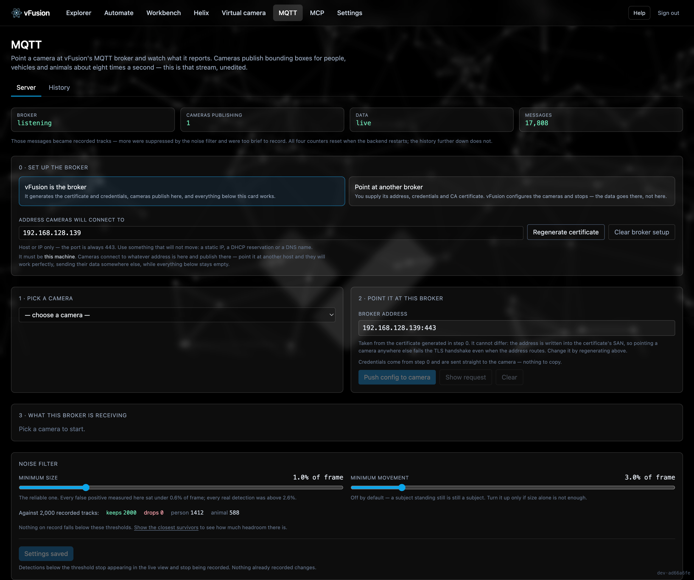
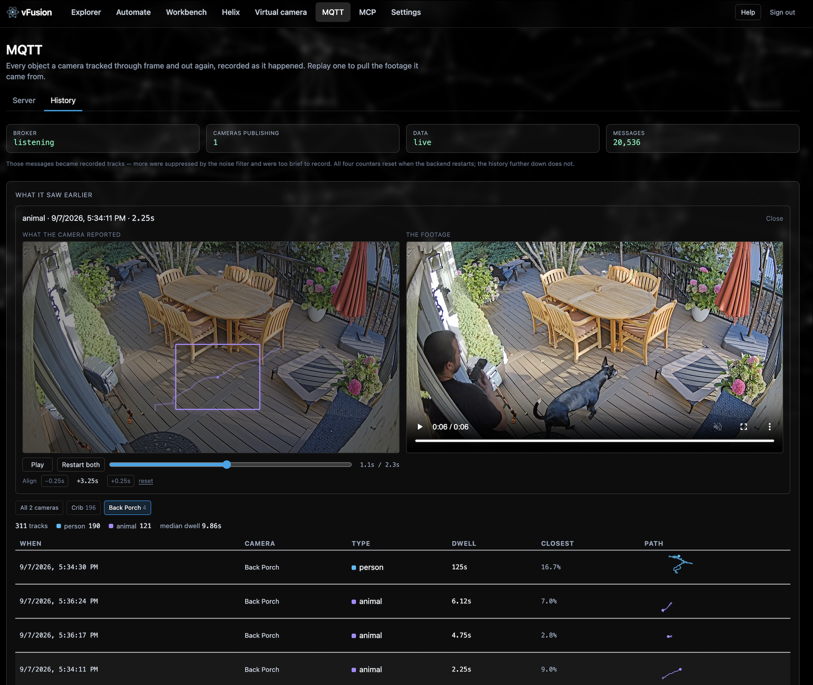

# MQTT

*Configure cameras to publish object positions, and watch what arrives.*

**Where:** the **MQTT** item in the nav. Two tabs: Server and History.
**Compose profile:** `docker compose --profile mqtt up -d` (adds `mqtt-broker` and `mqtt-tls`).

Verkada cameras can publish live bounding boxes for every tracked person, vehicle and animal to an MQTT broker, about eight messages a second per object. Setting that up by hand is a sequence of steps that all fail the same way: the camera connects and never publishes. This page checks each precondition and names the one that is wrong.

## Two ways to run it

- **Built in.** vFusion runs the broker, generates the certificate authority and credentials, points cameras at itself, and can therefore show what it receives: the live view, the noise filter and the history.
- **External.** You already have a broker. vFusion pushes the configuration to cameras and stops there. The requirements a broker must meet are listed on the page, each paired with the symptom you get without it.

## Server tab

A checklist, then a configurator:

1. Broker certificate generated
2. Broker reachable from vFusion
3. Camera online
4. People analytics enabled
5. Occupancy Trends line drawn
6. Already pointed at this broker

Then, per camera: see the exact request before sending it, push the configuration, and read it back. Counters for the broker, cameras publishing, data and messages reconcile with each other.

**Live view.** A still from the camera with the tracked boxes drawn on it and a walking figure for each person, plus an estimated latency.

**Noise filter.** Cameras report things that are not there. Measured over 227 tracks on one camera, 221 never moved more than 2% of the frame and clustered in the same three spots. Every false positive was under 0.6% of the frame; every real detection over 2.6%. So the default filter is area, movement is optional, and the page previews exactly which tracks a threshold would remove before you apply it.

## History tab

Completed tracks, one row per object, written when it leaves view: its path, how long it stayed, and a replay beside the footage it came from, with a timeline and a nudge control to align the two.

## What a broker has to do

Reverse-engineered from packet captures and confirmed against Verkada's setup guide. None of it is discoverable from the API.

- Accept MQTT over WebSocket Secure, not raw MQTT over TLS.
- Terminate a TLS 1.3-only ClientHello with post-quantum key share (X25519MLKEM768).
- Be given the **CA**, not the server certificate, on the camera; the CA must carry `basicConstraints=CA:TRUE`; the leaf needs `extendedKeyUsage=serverAuth` and a SAN that contains the exact address the camera is told.
- Listen on 443, 123 or 53. Verkada accepts no other port.
- Require a username and password. Without both, Verkada returns 200 and stores nothing.
- The camera needs people analytics on and an Occupancy Trends line drawn, or it connects and sits silent.
- Publishes arrive on `/occupancy_trend/tracks`. A camera reconnects only when its configuration *changes*.

## How it is built

- `mqtt/mosquitto.conf` and `mqtt/nginx.conf` — the broker and the TLS/WSS terminator on port 443.
- `backend/app/mqtt/provision.py` — certificates and credentials generated in-process, so nobody runs openssl by hand.
- `backend/app/mqtt/ingest.py` — subscribes to the firehose and keeps live state in memory; tracks expire on a timer because there is no "object left" message.
- `backend/app/mqtt/history.py` — tracks, not messages, appended to a file on the assets volume.
