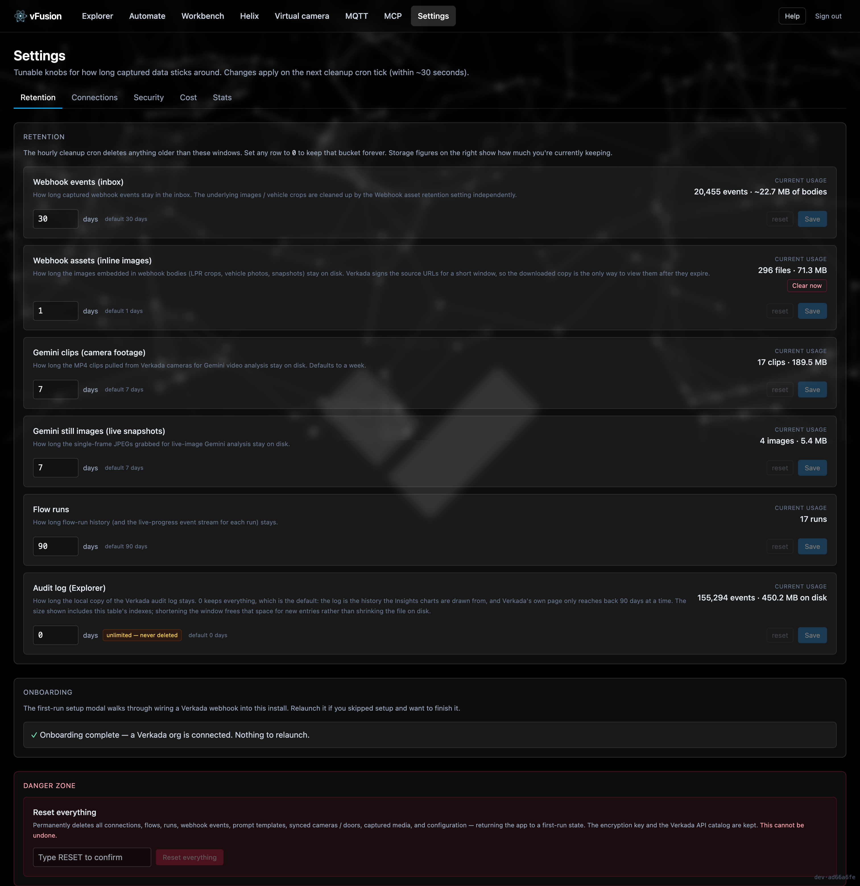
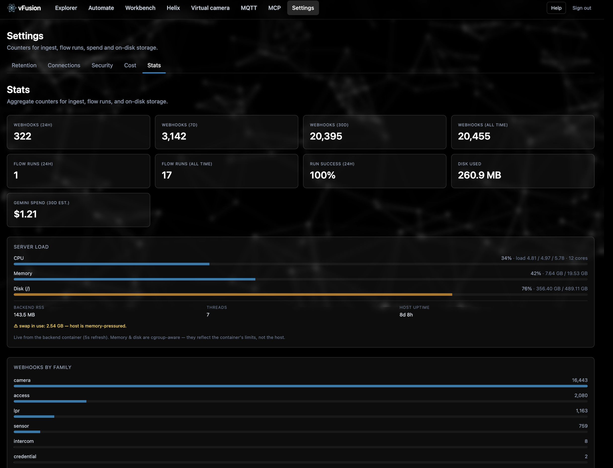

# Settings

**Where:** the **Settings** item in the nav. Six tabs: Retention, Connections, Security, Cost, Stats, Updates.

## Connections

The credentials this install can use. Secrets are Fernet-encrypted before they reach Postgres; the UI shows the last five characters of a stored key and nothing more.

| Type | Holds | Used by |
|---|---|---|
| **Verkada Org** | Org id, API key, webhook signing secret, API region (US, EU, AU, GovCloud) | Every Verkada action, footage, Helix, the API runner, the audit log, MCP |
| **Google Gemini** | API key | Analysis steps, the analytic composer, the flow builder and assistant, Helix drafting and demos, the help chat, video generation |
| **OpenWeatherMap** | API key | The weather action |
| **Slack** | Incoming webhook URL | The Slack message action. One connection per channel |
| **Discord** | Channel webhook URL | The Discord message action. One connection per channel |

- The first webhook **auto-creates** the Verkada connection; you add the API key afterwards.
- **Generate** produces a signing secret from 48 random bytes. Paste it into Command's webhook config so every event is HMAC-verified.
- **Sync** cameras, doors and Persons of Interest so pickers show names instead of UUIDs.
- **Send test** on a Slack or Discord connection posts one message to the channel. A revoked webhook and a mistyped one look identical until something tries to use them, so this answers it when the URL is pasted rather than when a flow fires.
- The region matters: an API key only authenticates against its own region's hostname, and the wrong one fails every call with a 401 or 403.

## Retention

The hourly cleanup deletes anything older than these windows. `0` keeps a bucket forever. Each row shows what it is currently holding.

| Bucket | Default |
|---|---|
| Webhook events | 30 days |
| Webhook assets (inline images) | 1 day |
| Gemini clips (camera footage) | 7 days |
| Gemini still images | 7 days |
| Flow runs | 90 days |
| Audit log | keep forever |

**Reset everything** wipes the install back to first-run, behind a type-to-confirm.

## Security

Every value on this tab is measured from the running install. A checklist that reads the same on a healthy install and a compromised one is decoration.

- **Keys this install stands on.** Whether the cookie-signing key and the encryption key were generated or supplied, and where they live.
- **Sign-in and sessions.** Password-guessing throttle state, cookie flags, and **Sign out everywhere**, which revokes every issued session.
- **Two-factor authentication.** Off by default, recommended. Set-up is three deliberate steps: scan the QR with an authenticator app (1Password, Google Authenticator, Authy…), prove the phone has it by entering a live code, confirm the password. Ten one-time backup codes are shown once at the end. Turning it off or issuing new codes needs the password and a current code. If both the phone and the codes are gone, delete `mfa.json` from the `vfusion_secrets` volume on the docker host and restart the backend. The secret is Fernet-encrypted inside that file and never stored in Postgres, so a database reset cannot silently turn it off. After a correct password the login answers with a five-minute challenge instead of a session; the code redeems it.
- **API key use from unexpected IPs.** vFusion's Verkada key should only ever be used from vFusion. This monitor walks the audit log on a schedule, learns its own address from what Verkada saw, and flags any other address using the key.
- **Reachable without signing in.** The real list of paths that answer without a session: `/hooks`, `/api/auth`, `/api/config`, `/api/health`, `/onvif`. The framework's docs pages are not served.
- **Sensitive data at rest.** What is encrypted, and what is not.

## Cost

Where the money went, and a **spending cap** that pauses flows for the rest of the month when this install's estimated Gemini spend reaches it. Runs stopped this way are recorded and resume when the cap is raised.

Every way vFusion spends is listed, including the ones at zero, so a feature you have used that still reads $0.00 is visibly missing its accounting: flow runs, the analytic composer, the flow builder, the flow assistant, the Helix demo composer, Helix type drafting, the help chat, and video generation (billed per second, not per token).

The cap can only stop vFusion. Set a budget on the Google Cloud project as well; that one is the actual ceiling.

## Stats

Ingest and flow-run counters for 24 hours, 7 days and 30 days, on-disk storage per bucket, event-type coverage, and real-time server load.

Two things used to live here and no longer do. The webhook breakdowns moved to **Explorer → Webhooks → Insights**, because they summarise the rows on the other half of that tab and the reason to look at one is always to go and look at the other. Gemini spend moved to **Cost**, because it is the answer to why the number at the top of that page is the size it is.

## Updates

Which release is running, whether a newer one exists, and the command to take it.

The header only shows an **Update** badge when there is something to do, so the up-to-date case has nowhere to live in the chrome. This tab is where it lives, along with the things the badge deliberately hides: when the check last ran, whether it failed and why, which channel it follows, and a **Check now** button that skips the six-hour cache instead of waiting for it.

An update hidden with **Not now** can be put back in the header from here.

vFusion asks GitHub for its own release list every six hours and caches the answer, so a restart does not trigger a fresh call. The request is an ordinary unauthenticated read carrying no version, no org and nothing else about the install. `UPDATE_CHANNEL` picks the line it follows: `beta` for any published release, `stable` for only those not marked pre-release, `off` for no outbound request at all.

There is no update button and there will not be one. A container cannot replace itself, so the only way to give an app that power is to mount the Docker socket, which is root on the host. Updating is [`./update.sh`](deploying.md#updating).

## Help

The **Help** button in the header opens a chat that knows vFusion specifically: what exists, how it works, what it refuses to do, and where a thing lives. Its knowledge is assembled from the source at runtime (docstrings, the action registry, the route table, this documentation), so it changes when the code does. Each answer shows what it cost. It uses your Gemini key.
