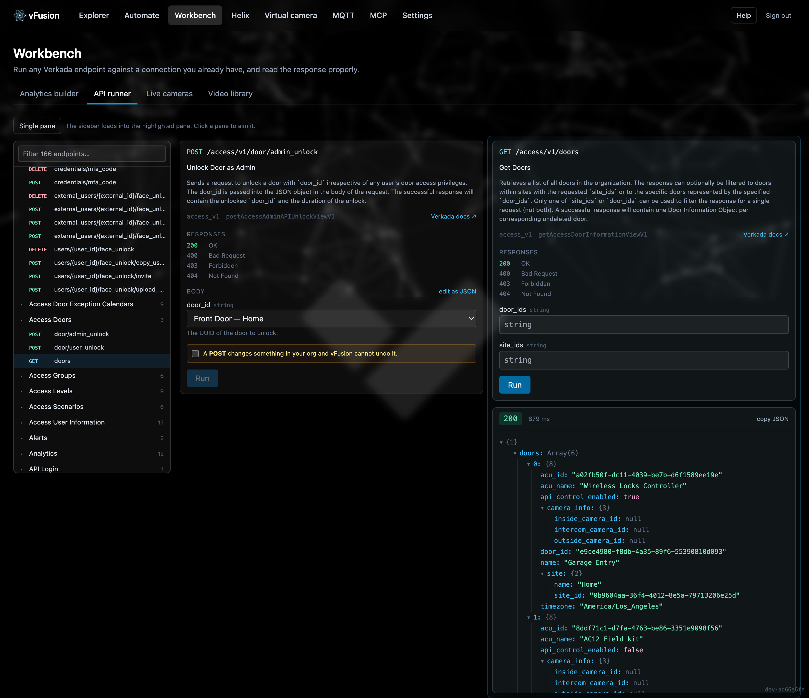
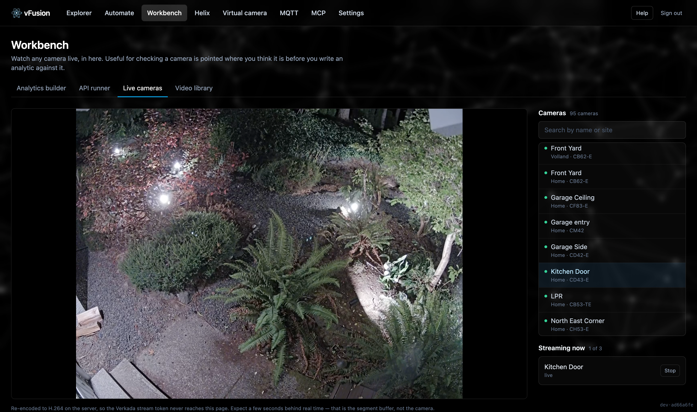

# Workbench

*Try things before you build them.*

**Where:** the **Workbench** item in the nav. Four tabs: Analytics builder, API runner, Live cameras, Video library.

## Analytics builder

A smoke test for an idea. Run a prompt once against your own cameras and see whether it works here, on your scenes, in your lighting, before building a flow on top of it.

- **Describe it, or write it.** Say what you want to find and the composer writes the prompt, the Helix event type and the mapping between them. Or start from a preset and edit.
- **Two questions, six answers.** *When* to capture — live, or a moment in the past — and *what* — a still frame, video, or audio. Every combination works: a frame from right now, a clip around last Tuesday at 3pm, ten seconds of audio recorded live. Or skip the camera and upload an MP4 or image up to 200 MB. Picking an audio analytic switches the medium to audio automatically.
- **The cost is stated where the choice is made.** A still frame is the cheapest thing here; audio is about an eighth of video for the same span; a live capture takes its own length in real time.
- **What happens to the result.** Optionally chain a Helix post, or, for an upload, see the exact JSON that *would* be posted with nothing sent to Verkada.
- **Live cost estimate** before you run.
- **Save it** as an analytic so it appears in the flow editor's analysis step and on Automate → Analytics. **Automate** builds a flow from a working run and asks only what should start it.
- Results render on the Runs page like any flow run: the clip or frame, the per-phase checklist, the log.

## API runner

Run any Verkada endpoint against a connection you already hold and read the response properly.

- Browse by category, the way Verkada's docs are organised, or search.
- Body parameters render as fields, like the docs.
- Camera, door and time pickers fill ids you cannot know by heart.
- The token exchange is shown, the resolved URL and method are echoed back, and non-GET calls are flagged as writes.

The catalog behind it is crawled from Verkada's published OpenAPI specs every four hours and is the same catalog the generic **Verkada API call** flow action uses.

## Live cameras

Watch any camera in the browser. Useful for checking a camera is pointed where you think it is before writing an analytic against it.

Verkada's stream URL carries a token good for the whole org's footage, so the browser never sees it: ffmpeg reads the stream and the browser is served re-encoded HLS from local disk. Sessions are shared between viewers of the same camera, capped at three at once (`LIVE_MAX_SESSIONS`), and stopped the moment nobody is watching.

## Video library

Clips for the [virtual camera](virtual-camera.md) and for live Helix demos.

- **Upload** your own footage.
- **Generate** footage with Veo that looks like it came off a fixed camera. The request is mostly constraints (mount height, fixed focus, no bokeh, no cuts); the scene is the small part you type.
- Generation runs in the background and survives the page closing. A container restart marks in-flight jobs interrupted rather than leaving them claiming to run.
- Every clip has **Add to the virtual camera's queue**.

Video generation is billed per second of output and is by far the most expensive thing in the product. It is on the Cost page.
